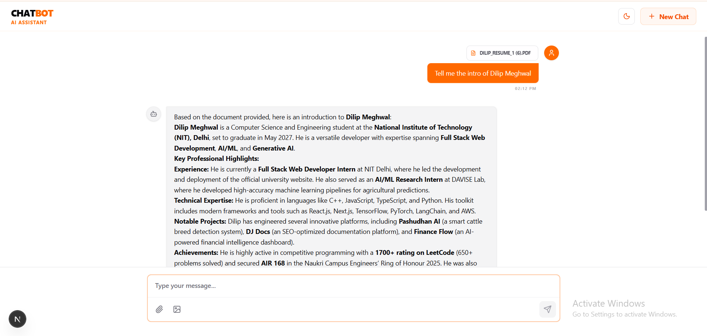

# 🤖 AI ChatBot — Advanced Multimodal Assistant

[](https://chatbot.dilip.live)
[](https://github.com/DJ-InfinityCoder/ChatBot.git)



A professional, high-performance AI chatbot built with **Next.js 16**, **Tailwind CSS 4**, and powered by the state-of-the-art **Gemini 3 Flash** model. This assistant supports multimodal interactions, including image analysis and PDF document parsing, all wrapped in a sleek, "Pro" level interface.

---

## ✨ Key Features

- **🚀 Zero-Latency UI**: Instant "Thinking" state feedback as soon as you send a message.
- **🖼️ Multimodal Intelligence**: Upload images for instant visual analysis and content description.
- **📄 Document Parsing**: Robust PDF analysis using `pdf-parse-fork` for deep contextual understanding.
- **🌊 Ultra-Smooth Streaming**: High-frame-rate text generation animation powered by `requestAnimationFrame`.
- **🎨 Premium Aesthetic**: 
  - Minimalism-first design with an Orange/Amber theme.
  - Custom glassmorphism effects and tailored chat bubbles.
  - Full support for **Light and Dark modes**.
- **📋 One-Click Copy**: Easily copy AI-generated responses with integrated feedback animations.
- **🛡️ Robust Reliability**: Automatic retry logic for high-demand periods and graceful error handling.

---

## 🛠️ Tech Stack

- **Framework**: [Next.js 16 (App Router)](https://nextjs.org/)
- **Frontend**: [React 19](https://react.dev/), [Framer Motion](https://www.framer.com/motion/)
- **Styling**: [Tailwind CSS 4](https://tailwindcss.com/)
- **AI Engine**: [Google Gemini 3 Flash](https://deepmind.google/technologies/gemini/)
- **Icons**: [Lucide React](https://lucide.dev/)
- **Theming**: [next-themes](https://github.com/pacocoursey/next-themes)

---

## 🚀 Getting Started

### Prerequisites

- Node.js 18.x or later
- npm / pnpm / yarn
- A [Gemini API Key](https://aistudio.google.com/app/apikey)

### Installation

1. **Clone the repository**
   ```bash
   git clone https://github.com/DJ-InfinityCoder/ChatBot.git
   cd ChatBot
   ```

2. **Install dependencies**
   ```bash
   npm install
   ```

3. **Environment Variables**
   Create a `.env.local` file in the root directory:
   ```env
   GEMINI_API_KEY=your_api_key_here
   ```

4. **Run the development server**
   ```bash
   npm run dev
   ```
   Open [http://localhost:3000](http://localhost:3000) with your browser to see the result.

---

## 📖 Usage

1. **Chat**: Just type and press Enter to start a conversation.
2. **Analyze Images**: Click the image icon or drag-and-drop an image to ask questions about it.
3. **PDF Insights**: Upload a PDF using the paperclip icon to extract text and perform analysis.
4. **Suggestions**: Use the home screen suggestion cards to quickly trigger common tasks.

---

## 🤝 Contributing

Contributions are welcome! Feel free to open issues or submit pull requests to improve the chatbot.

## 📄 License

This project is licensed under the MIT License.

---

Developed with ❤️ by [Dilip](https://github.com/DJ-InfinityCoder)
